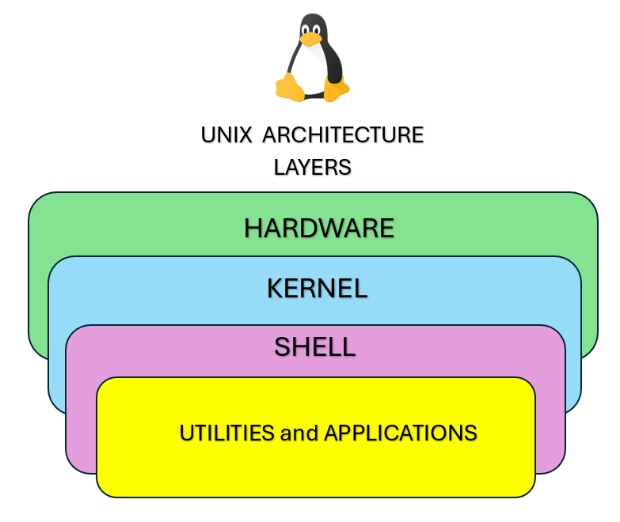

# Tinitiate UNIX OS Layers and Folder Structure 
> (c) TINITIATE

## Introduction
* The UNIX file system is a hierarchical structure that organizes files and directories in a tree-like format.
* This structure starts at the root directory and branches out into various subdirectories and files.
* Understanding the UNIX file system is crucial for effective navigation, file management, and system administration.

## UNIX Architecture

### UNIX Operating System Layers
1. **Hardware Layer**: Physical components of the computer system.
2. **Kernel Layer**: Manages hardware resources and provides essential services.
3. **Shell Layer**: Interfaces between the user and the kernel. Executes user commands and scripts.
4. **Utilities and Applications Layer**: Provides system utilities and standard applications for various tasks.

## UNIX Directory Structure

### Root Directory
* The root directory is denoted by a forward slash `/`
* It is the top-level directory from which all other directories branch out

### Paths
* Absolute Path: Begins from the root directory (e.g., `/home/user/documents`).
* Relative Path: Starts from the current working directory (e.g., `documents/reports`).

### Directory Structure
| Directory      | Description                                               |
|----------------|-----------------------------------------------------------|
| `/bin`         | Essential command binaries (e.g., `ls`, `cp`).            |
| `/boot`        | Boot loader files.                                        |
| `/dev`         | Device files.                                             |
| `/etc`         | Configuration files.                                      |
| `/home`        | Home directories for users.                               |
| `/lib`         | Essential shared libraries and kernel modules.            |
| `/media`       | Mount points for removable media.                         |
| `/mnt`         | Temporary mount points.                                   |
| `/opt`         | Optional application software packages.                   |
| `/proc`        | Virtual filesystem for system processes.                  |
| `/root`        | Home directory for the root user.                         |
| `/sbin`        | System binaries (e.g., `shutdown`, `reboot`).             |
| `/srv`         | Data for services provided by the system.                 |
| `/tmp`         | Temporary files.                                          |
| `/usr`         | Secondary hierarchy for read-only user data.              |
| `/usr/bin`     | Non-essential command binaries.                           |
| `/usr/lib`     | Libraries for `/usr/bin` and `/usr/sbin`.                 |
| `/usr/local`   | Local hierarchy for system administrator-installed software.|
| `/var`         | Variable data files (e.g., logs, databases).              |
